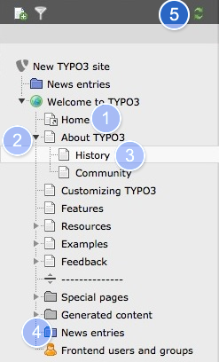
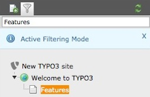
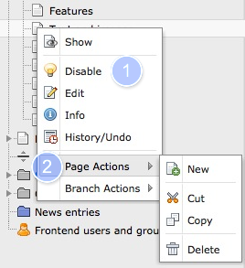

.. ==================================================
.. POUR VOTRE INFORMATION
.. --------------------------------------------------
.. -*- coding: utf-8 -*- with BOM.

.. include:: ../../Includes.txt

.. _page-tree:

L'arborescence
--------------

Dans l'arborescence, vous allez retrouver différentes icônes :

#. La page "Home" est un **raccourci** , cela signifie que si un utilisateur visite cette page, il sera redirigé vers une page différente

#. Cliquez sur la flèche pour ouvrir ou fermer l'arborescence du répertoire ou de la page.

#. La page "History" est une page **standard**

#. "News Entries" n'est pas une page mais un **répertoire**, ils sont utilisés pour
   stocker différents éléments, par exemple news, newsletters, guest book
   entries, etc.

#. Si vous avez créé une page et qu'elle n'apparait pas, ce bouton vous permettra de rafraichir l'arborescence.

Utilisez le filtre (en cliquant sur l'icône) pour délimiter les pages affichées dans l'arborescence.

Notez qu'il y a une différence en cliquant sur l'icône ou le nom de la page.
En cliquant sur l'icône, cela ouvrira un menu avec différentes options.
Tandis qu'en cliquant sur le nom de la page, cela chargera le contenu de la page.