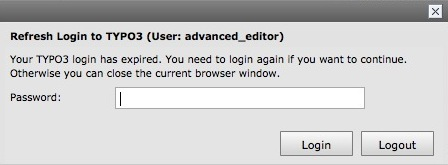

.. ==================================================
.. FOR YOUR INFORMATION
.. --------------------------------------------------
.. -*- coding: utf-8 -*- with BOM.

.. include:: ../../Includes.txt

.. _headerbar:

Barre d'en-tête
^^^^^^^^^^^^^^^^^

A côté du logo TYPO3, vous trouverez les fonctions suivantes:

#. Votre nom d'utilisateur et le bouton de déconnexion
#. L'ajout aux favoris et espaces de travail
#. La recherche

Pour des raisons de sécurité, la session expire après quelques minutes de non-utilisation du système. L'affiche suivant permet alors de vous reconnecter:

Vous pouvez actualiser la session mais les modifications non enregistrées seront perdues. ATTENTION: enregistrez vos modifications régulièrement. Pour rappel, TYPO3 enregistre les données et les fichiers sur le serveur et non sur votre ordinateur en localVous pouvez actualiser la session, mais les modifications non enregistrées seront perdues - garder à l'esprit, pour enregistrer les modifications régulières. TYPO3 enregistre les données et les fichiers sur le serveur et non sur votre PC..
