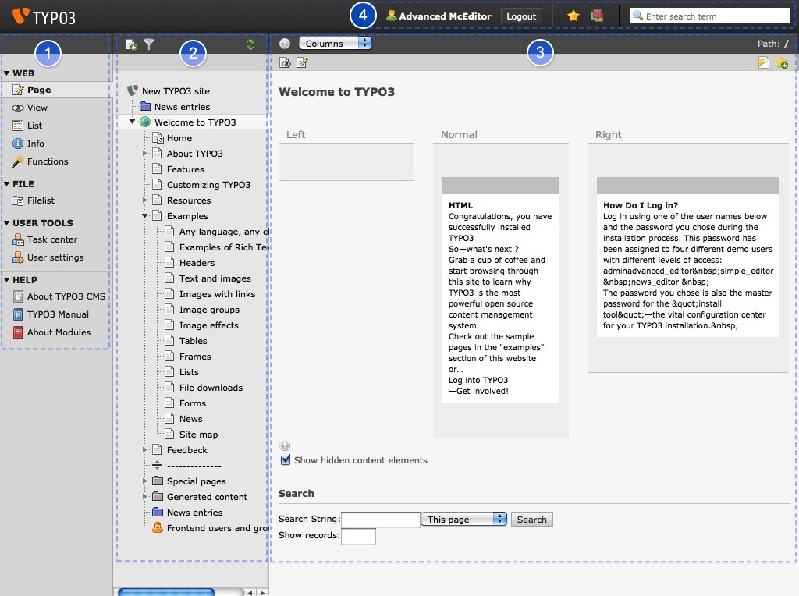

.. ==================================================
.. POUR VOTRE INFORMATION
.. --------------------------------------------------
.. -*- coding: utf-8 -*- with BOM.

.. include:: ../Includes.txt

.. _overview:

Aperçu
--------

Vous êtes maintenant dans ce que l'on appelle le **backend** de votre site. Ceci par opposition au **frontend**, qui est représenté par le site lui-même. De manière générale, toute modification du site se fera ici, via le **backend**. Il est possible, dans certains cas, de pouvoir éditer du contenu directement depuis le site (**frontend**) mais la présente documentation présente l'édition via le **backend**.

Le backend est divisé en **trois colonnes**. En sélectionnant le menu "Page" dans la première colonne, vous verrez un écran similaire à celui-ci:

La première colonne [1] comprend le **menu** qui est utilisé pour sélectionner la tâche que vous souhaitez effectuer. La seconde colonne [2] contient l'**arborescence** qui représente la hiérarchie des pages du site web.
La troisième colonne [3] correspond à l'**espace de travail**. La quatrième zone [4] est appelée
**barre d'en-tête**. On y trouve par exemple le nom de l'utilisateur connecté et le bouton de déconnexion. Utilisez le bouton de déconnexion afin de clore la session sur le CMS. TYPO3 se souvient de votre dernière zone de travail et y reviendra à la prochaine connexion.

En complément, le visiteur du site web voit ce que l'on appelle le **frontend**
= votre site web.

.. toctree::
   :maxdepth: 5
   :titlesonly:
   :glob:

   BarreEnTete/Index
   Menu/Index
   Arborescence/Index
   ZoneDeTravail/Index

