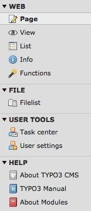

.. ==================================================
.. FOR YOUR INFORMATION
.. --------------------------------------------------
.. -*- coding: utf-8 -*- with BOM.

.. include:: ../../Includes.txt

.. _menu:

Menu
^^^^

Le menu est divisé en plusieurs modules. On peut voir les catégories **Web, Fichier, Configuration utilisateur et Aide**
et, par exemple, les modules **Page, Voir, Liste, Info, Fonctions, Fichiers**. Les catégories et modules disponibles peuvent différer 
d'une instance TYPO3 à une autre en fonction de votre projet.

La catégorie principalement utilisée est la catégorie **Web** et son module **Page**. 
Il permet de créer et d'éditer des pages web, de gérer les différentes langues et les contenus de page.

Le module **Voir** montre la page web courante comme elle s'affiche en FrontEnd.

Le module **Liste** permet d'accéder aux éléments tels que stockés dans la base de données, table par table.

Indépendamment de votre configuration, vous devriez accéder à la catégorie **Utilisateur** avec un module de 
**Configuration utilisateur** et éventuellement un **Centre des tâches**.

Ce présent tutoriel ne comprend pas le versioning, les espaces de travail ni les autres modules avancés.

On retrouve également un moudle assez important: **Fichiers**. Il est utilisé pour stocker toute sorte de fichier comme les images, les pdf, ... sur le serveur. 

On retrouve les explications des différents modules dans le module **A propos des modules** dans la catégorie **Aide**.
Il est possible de fermer ou d'ouvrir une catégorie en cliquant sur la petite flèche qui précède le titre.

