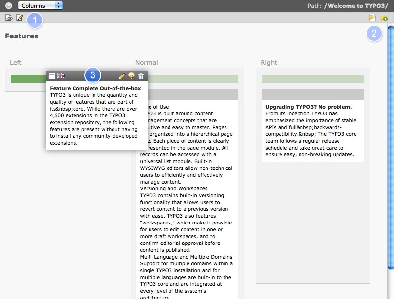

.. ==================================================
.. FOR YOUR INFORMATION
.. --------------------------------------------------
.. -*- coding: utf-8 -*- with BOM.

.. include:: ../../Includes.txt

.. _work-area:

La zone de travail
------------------

La zone de travail affiche le module sélectionné avec le contenu de la page que vous avez sélectionnée dans l'arborescence des pages.
C'est la partie du **backend**, dans laquelle vous travaillerez le plus.
L'intérieur de la zone de travail sert à créer et à modifier du contenu et des pages.
Les sections suivantes contiennent tous les détails que vous devez savoir au sujet de la zone de travail.

La vue standard est **Columns** et affiche toutes les colonnes possibles de la page,
**Quickedit** est plus pour les rédacteurs avancé et **Languages** affiche toutes les traductions disponibles de la page.

#. L'icône de gauche (page avec un oeil) ouvre un aperçu dans une nouvelle fenêtre, l'icône de droite
   (crayon) ouvre les propriétés de la page

#. Dans le coin supérieur droit vous verrez toujours la page ou le répertoire courant(e).
   L'icône pour vider le cache de la page (l'éclair) et créer un bookmark vers cette page.

#. Pour déplacer les éléments de contenu en haut ou en bas dans une colonne ou entre d'autres éléments de contenu avec
   le curseur (en maintenant le click).

   La barre verte dans la colonne de gauche est en surbrillance pour indiquer la prochaine position
