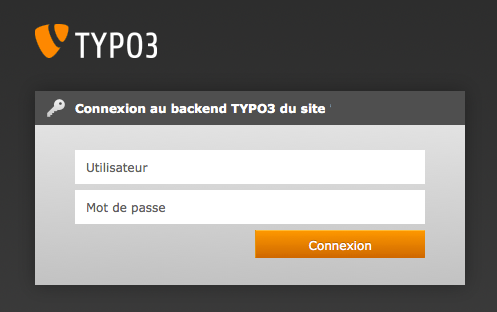

.. ==================================================
.. POUR VOTRE INFORMATION
.. --------------------------------------------------
.. -*- coding: utf-8 -*- with BOM.

.. include:: ../Includes.txt

.. _login:

Connexion
----------

Commençons par le début: la connexion au CMS TYPO3.

Entrez votre nom de domaine dans la barre d'adresse de votre navigateur internet et ajoutez ``/typo3``. Bienvenue sur la page de connexion du CMS TYPO3 qui gère votre site web.

Exemple: http://www.exemple.com/typo3.

Voici la fenêtre de connexion qui apparaît:

- Entrez votre nom d'utilisateur dans le champ "Nom d'utilisateur"

- Entrez votre mot de passe dans le champ "Mot de passe"

- Cliquez sur le bouton [Connexion] ou sur [Enter] sur le clavier.

.. toctree::
   :maxdepth: 5
   :titlesonly:
   :glob:

   Aide/Index