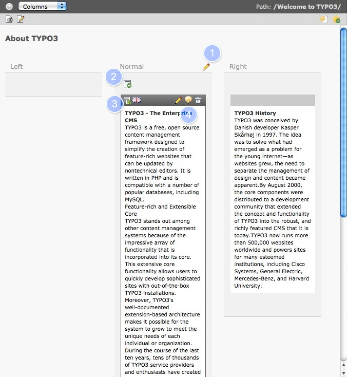

.. ==================================================
.. FOR YOUR INFORMATION
.. --------------------------------------------------
.. -*- coding: utf-8 -*- with BOM.

.. include:: ../../Includes.txt

.. _content-working:

Travailler avec les contenus
----------------------------

Nous allons maintenant parler de l'espace de travail du module Page, où la majorité
du travail sera faite. Ne soyez pas effrayé par le nombre d'icône et boutons, car certains sont un peu redondants.
Utilisez la souris pour survoler (ne pas cliquer) par dessus n'importe quelle icône pour voir l'aide.
Dans un premier temps nous allons parler du travail avec le contenu, plus tard nous allons parler de comment travailler avec les pages.

La copie d'écran montre l'espace de travail du module page après avoir
cliqué sur le nom de la page dans l'arborescence. Vous pourrez voir deux **éléments de contenu** l'un dans
la colonne nommée *Normal* et l'autre dans *Right*, la colonnes *Left* est vide.

Les éléments de contenu sur cette page sont de type **Texte** et **Texte avec image**,
et nous étudierons plus à propos les différents types de contenu plus tard.
Survolez sur une colonne ou bien un élément de contenu pour la/le mettre en surbrillance, vous pourrez voir les icônes.

#. Editer tous les éléments de contenu d'une colonne.

#. Ajouter un nouvel élément de contenu dans cette colonne.

#. L'icône de l'élément de contenu *Texte avec image*

#. Editer, activer/désactiver ou supprimer l'élément de contenu.

Vous pouvez cliquer n'importe où sur la zone en surbrillance de l'élément de contenu pour l'éditer.