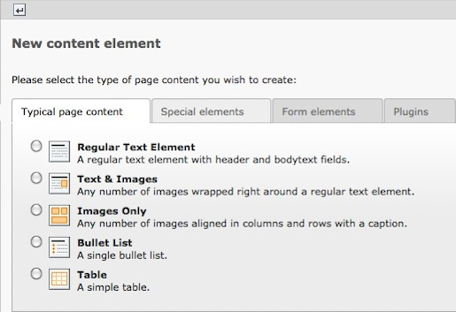
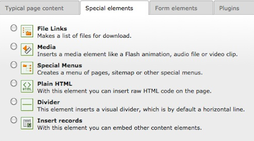
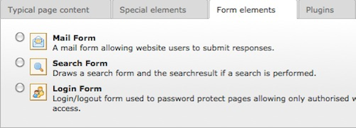
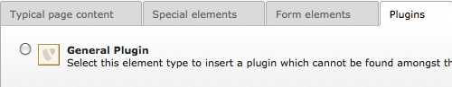

.. ==================================================
.. FOR YOUR INFORMATION
.. --------------------------------------------------
.. -*- coding: utf-8 -*- with BOM.

.. include:: ../../Includes.txt

.. _content-creating:

Créer des contenus
------------------

Une fois que vous avez cliqué pour créer un nouvel élément de contenu, vous aurez à disposition une page avec les différents types de contenu à disposition.
Notez que la disponibilité des types de contenu est dépendant des modules installés sur votre système TYPO3, ainsi que des droits d'accès octroyés.

A la 1ère étape vous pouvez sélectionner quel type de contenu vous souhaitez placer sur la page. Vous pouvez naviguer dans les autres onglets pour choisir entre les différents types d'éléments de contenu.

A l'étape suivante, vous pourrez éditer votre nouvel élément de contenu.

.. _content-typical:

Contenus de pages typiques
^^^^^^^^^^^^^^^^^^^^^^^^^^

.. _content-special:

Éléments spéciaux
^^^^^^^^^^^^^^^^^

.. _content-form:

Éléments de formulaire
^^^^^^^^^^^^^^^^^^^^^^

.. _content-plugin:

Plugins
^^^^^^^

In the next step you will already insert your first content
