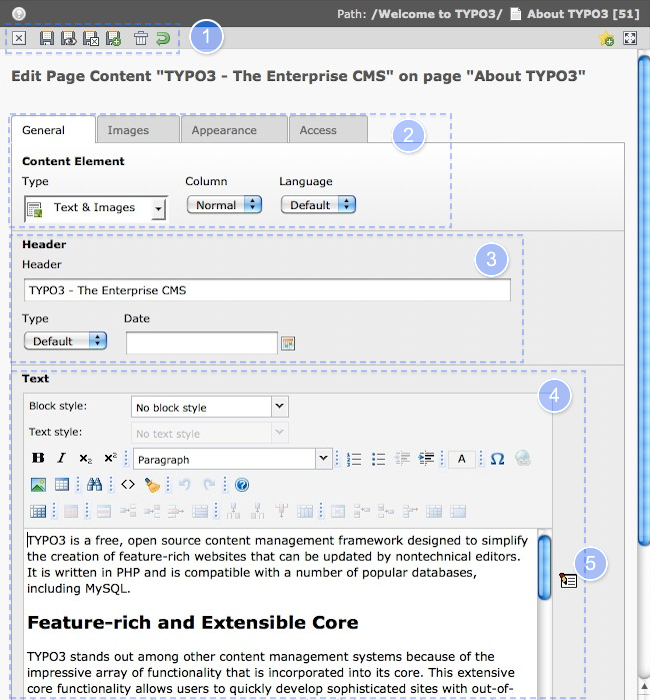

.. ==================================================
.. FOR YOUR INFORMATION
.. --------------------------------------------------
.. -*- coding: utf-8 -*- with BOM.

.. include:: ../../Includes.txt

.. _content-editing:

Éditer des contenus
-------------------

La zone de travail pour éditer et pour créer des contenus est identique.
La seule différence est que si vous éditer un élément existant, le formulaire est
déjà rempli. Dans cette section vous trouvez une description des différents composants de la zone de travail
lorsque vous travaillez avec un contenu du type **Texte et images**. Celà concerne également le type de contenu **Texte**.

#. Fermer, Sauvegarder, (+ preview, + close, + new record) delete this content element or undo last changes

#. General Settings are Type, Column and Language, depending on the type of content element there
   are different tabs. Switching between the tabs keeps changes. The top area contains the
   header of the element, as well as the type, which you can change. Be aware that changing a
   text with image element to a text element will cause it to loose all pictures.

#. Header area of this content element

#. Text area of this content element with Rich Text Editor (RTE), we will discuss the RTE later.

#. Opens the RTE in fullscreen mode