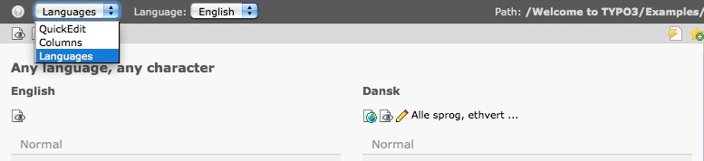
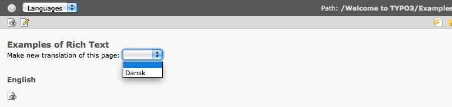
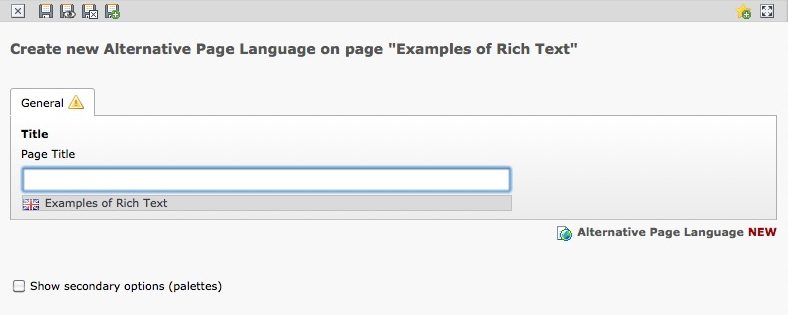
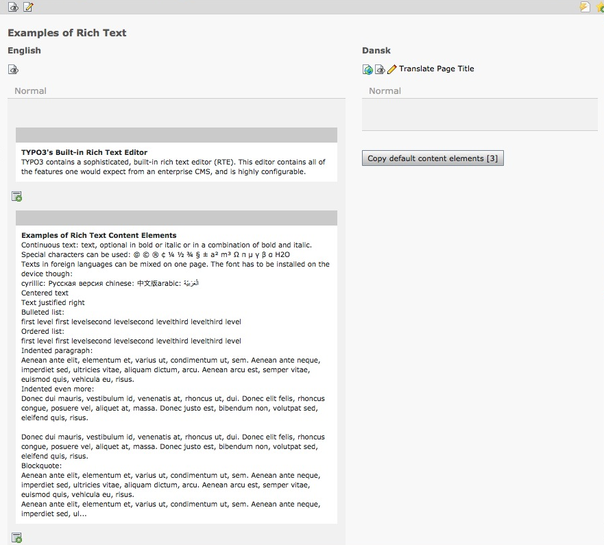
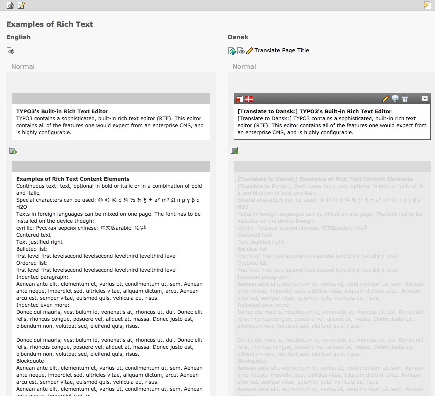

.. ==================================================
.. FOR YOUR INFORMATION
.. --------------------------------------------------
.. -*- coding: utf-8 -*- with BOM.

.. include:: ../Includes.txt

.. _languages:

Travailler avec des langues
===========================

Si votre site est disponible en plusieurs langues, vous aurez différentes traduction pour la même page.
Voici ce que vous devez savoir.

Dans la partie supérieure du **Module Page**, un sélecteur est disponible, afin de choisir l'option **Langues**.

Si vous voulez traduire une page existante, il faut cliquer sur le bouton **Faire une nouvelle traduction de cette page**
dans le

button **Make new translation of this page** with a drop-down
menu of the available languages. Choose the one you want, in our
example the available language is "dansk".

Then enter the new translation of the page name in the field
**Pagetitle** and save.

Now you can **copy the content of the page in the source language**
to the new language. This is quite useful, if you have content
which you would like to see in the version of the new language as
well. You can also **create an entirely new version** of the page.

Now you are prepared to work on the translation of the content at any
content element starting with *[Translate to "new language"]*. (Replace
New Language with "Dansk" in our example)

If this two column mode is a little confusing, you can go back to the
old view of the work area by selecting **Columns** in the dropdown
menu, where you previously selected Languages.
Note that you can now switch between the different translations of the
page with another drop-down menu below the one you just used.

